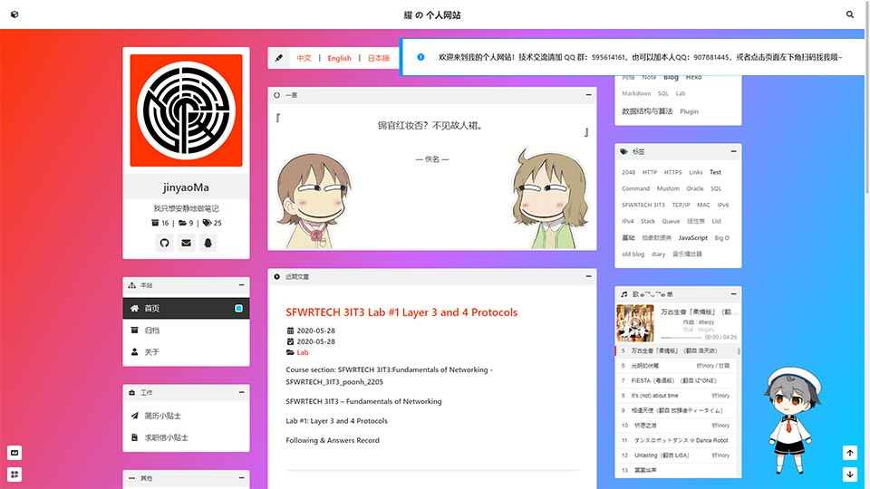
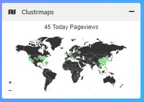
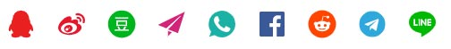
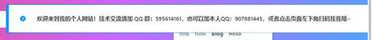
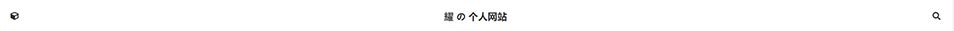
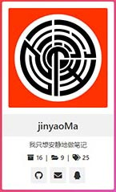
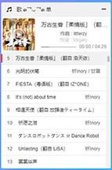
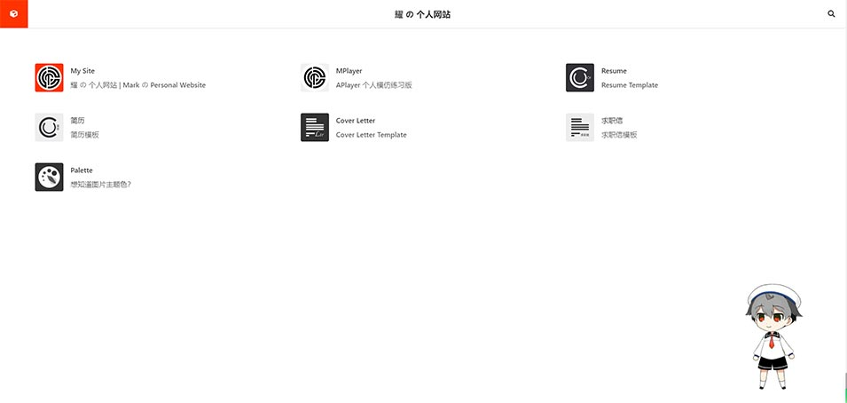

<h1 align="center">Mustom</h1>

<div align="center">

Simple design theme for VuePress，Blog，耀 の 个人网站 | Mark の Personal Website (QQ Group: 595614161)

</div>

<div align="center">

  

</div>



Language:
- [中文](https://github.com/jinyaoMa/vuepress-theme-mustom/blob/master/README.zh.md)
- [English](https://github.com/jinyaoMa/vuepress-theme-mustom/blob/master/README.md)

# Installation

Create a folder with structure as below, and for detailed source folder structure `$docs`, see [\$docs](./$docs).

```yml
# inside the new folder of your site

+ $docs # folder contains source of your site
  - _posts # folder contains posts
  - .vuepress # folder contains static source and config
    + public # folder contains static source
    + config.js # file stores configuration
+ package.json # file generated by using `npm init`
```

Run one of the following commands in the new folder of your site to install `vuepress` and `vuepress-theme-mustom`.

```bash
yarn add vuepress-theme-mustom -D
```

or with npm

```bash
npm i vuepress-theme-mustom -D
```

or manually download the clone `.zip` file [here](https://github.com/jinyaoMa/vuepress-theme-mustom/archive/master.zip), and extract the theme source code to the new folder of your site. Then, set `theme` attribute of `config.js` as below.

```js
theme: require.resolve('../../vuepress-theme-mustom-master/')
```

# Explanation of `_secret.tpl.js`

To see how my `_secret.tpl.js` looks like, click [here](./$docs/.vuepress/_secret.tpl.js).

Using a secret config file, any `appid` and `appkey` can be stored locally and referred to `config.js` as showed below.

```js
const secret = require('./_secret');

module.exports = { // https://www.vuepress.cn/zh/config/
  // ...
  themeConfig: {
    // ...
    translate: secret.translate, // baidu translation
    comment: secret.comment, // vssue setting
    // ...
  }
  // ...
}
```

# Explanation of `config.js`

To see how my `config.js` looks like, click [here](./$docs/.vuepress/config.js).

## General VuePress Settings

```js
module.exports = { // https://www.vuepress.cn/zh/config/
  // Entry of used theme
  // theme: require.resolve('../../'), // My value
  // theme: require.resolve('../../vuepress-theme-mustom-master/'), // manually download theme
  theme: 'vuepress-theme-mustom', // Your value
  // Site base
  // base: '/', // My value, due to https://ma-jinyao.cn/
  base: '/MyBlog/', // Your value, if https://yourUsername.github.io/MyBlog/
  // Default title that appended to your site title
  // title: '耀 の 个人网站 | Mark の Personal Website', // My value
  title: 'XXX 的博客 | XXX\'s Blog', // Your value
  // Default description that appended to your site description
  description: 'XXX 的博客, XXX\'s Blog, XXX, Mustom, VuePress',

  themeConfig: {
    // ...
    // About this section, go to header "Configuration of themeConfig"
  }

  // It isn't necessary to change 'head' if you want to replace files directly
  // favicon is in folder $docs/.vuepress/public/
  // apple-touch-icon is in folder $docs/.vuepress/public/assets/img/
  head: [
    // PWA settings, https://www.vuepress.cn/plugin/official/plugin-pwa.html
    ['link', { rel: 'icon', href: '/favicon.ico', type: "image/x-icon" }],
    ['link', { rel: 'manifest', href: '/manifest.json' }],
    ['meta', { name: 'theme-color', content: '#ffffff' }],
    ['meta', { name: 'apple-mobile-web-app-capable', content: 'yes' }],
    ['meta', { name: 'apple-mobile-web-app-status-bar-style', content: '#ffffff' }],
    ['link', { rel: 'apple-touch-icon', href: '/assets/img/apple-touch-icon.png' }]
  ],
  // It isn't necessary to change 'markdown' if you don't mind to use settings below
  // https://www.vuepress.cn/zh/config/#markdown
  markdown: {
    lineNumbers: false,
    extractHeaders: ['h1', 'h2', 'h3', 'h4', 'h5', 'h6']
  },
  // It isn't necessary to change 'evergreen'
  evergreen: true, // using old browser ?
  // To use jsdelivr cdn, you should change the publicPath below
  configureWebpack: () => {
    if (process.env.NODE_ENV === 'production') {
      return {
        output: {
          // My value, username=jinyaoMa, repo=vuepress-theme-mustom, branch=gh-pages
          //publicPath: 'https://cdn.jsdelivr.net/gh/jinyaoMa/vuepress-theme-mustom@gh-pages/'
          // Your value, if username=XXX, repo=MyBlog, branch=gh-pages
          publicPath: 'https://cdn.jsdelivr.net/gh/XXX/MyBlog@gh-pages/'
        }
      }
    }
  }
}
```

## Configuration of `themeConfig`

> All of following attributes are inside `themeConfig` of `config.js`

> `author`, `year`, `maximizeLaunch`, `noEmpty` and `images`; These attributes are very simple, and you can try yourselves. `maximizeLaunch` set to `true` can help you to fully fill the launch with image covering the window. `noEmpty` can disable the empty component that occupies the empty space. `images` can let you replace images in custom urls, but you need to follow the structure below.

```js
images: { // for image replacment; no base needed; first layer key points to component name
  ad: '/assets/img/ad.png',
  avatar: '/assets/img/avatar.png',
  brand: '/assets/img/brand.png',
  hitokoto: {
    left: '/assets/img/hitokoto.left.png',
    right: '/assets/img/hitokoto.right.png',
  },
  empty: '/assets/img/empty.png',
  records: '/assets/img/records.png',
},
```

### domain

This attribute is for sitemap generation **ONLY**.

- My value: `'https://ma-jinyao.cn'`
- Your Value: `'https://yourdomain.com/'`

### clustrmaps



Set `clustrmaps` to `null` or ignore it to disable above. This requires service from [clustrmaps.com](https://clustrmaps.com/).

```js
clustrmaps: {
  id: "clustrmaps", // clstr_globe / clustrmaps
  src: "//cdn.clustrmaps.com/map_v2.js?cl=333333&w=a&t=t&d=kuCCiVvtASTqmAMxPSTLcjxs-p8j6ht3LUi9z9Q-OKc&co=ffffff&cmo=3acc3a&cmn=ff5353&ct=333333"
},
```

### customBackgrounds

This attribute is for adding background images to the site under `skin-default`. If there are multiple images, they will be in slide show. You can have value looking like the below.

```js
customBackgrounds: [
  '/assets/img/background.png',
  'https://timgsa.baidu.com/timg?image&quality=80&size=b9999_10000&sec=1596065328389&di=ad7a9cc49e45547721005bd528325f0d&imgtype=0&src=http%3A%2F%2Fpic1.win4000.com%2Fwallpaper%2F2%2F58b4ef69ed377.jpg',
  'https://timgsa.baidu.com/timg?image&quality=80&size=b9999_10000&sec=1596063652971&di=8b659ee5cd46f4006d082b626eb3bd0d&imgtype=0&src=http%3A%2F%2Fpicture.ik123.com%2Fuploads%2Fallimg%2F180330%2F4-1P330160644.jpg'
],
```

### socialShare



Looking to [this](https://sns.goyfe.com/guide/) for reference. The following example generates the result of above.

```js
socialShare: { // https://sns.goyfe.com/guide/
  networks: ['qq', 'weibo', 'douban', 'email', 'whatsapp', 'facebook', 'reddit', 'telegram', 'line'],
  email: 'jinyao.ma@outlook.com',
  fallbackImage: '/assets/img/avatar.png',
  noGlobalSocialShare: true
},
```

### notification



> `msg` strings should be in current sequence/index. 0 => `zh`, 1 => `en`

You can have multiple notification on start up, and they will be displayed in sequence and one-by-one. `msg` contains both strings in `zh` and `en`. The following example generates the result of above.

```js
notification: [
  { // welcome msg
    type: 'default', // default or warning or error
    msg: [
      '<strong>欢迎来到我的个人网站！技术交流请加 QQ 群：595614161，也可以加本人QQ：907881445，或者点击页面左下角扫码找我哦~<strong>', // zh
      '<strong>Welcome to my personal website! <strong>' // en
    ]
  },
],
```

### qrcodes


> `locale` strings should be in current sequence/index. 0 => `zh`, 1 => `en`

`locale` contains both string in `zh` and `en`. The following example generates the result of above.

```js
qrcodes: [{ // qrcode for contact and friending
  locale: [
    'QQ', // zh
    'QQ' // en
  ],
  path: '/assets/img/qq.png' // no base needed
}, {
  locale: [
    '微信', // zh
    'WeChat' // en
  ],
  path: '/assets/img/wechat.png' // no base needed
}],
```

### header



> `sitename` strings should be in current sequence/index. 0 => `zh`, 1 => `en`

`sitename` contains both string in `zh` and `en`. The following example generates the result of above.

```js
header: {
  sitename: [
    '耀 の 个人网站', // zh
    'Mark の Personal Website' // en
  ]
},
```

### brand



> `signatures` strings should be in current sequence/index. 0 => `zh`, 1 => `en`

`signatures` contains both string in `zh` and `en`. The following example generates the result of above.

```js
brand: {
  signatures: [
    '我只想安静地做笔记', // zh
    'I just wanna note silently' // en
  ],
  contacts: [{
    icon: '<i class="fab fa-github fa-fw"></i>',
    text: 'jinyaoMa',
    link: 'https://github.com/jinyaoMa'
  }, {
    icon: '<i class="fas fa-envelope fa-fw"></i>',
    text: 'jinyao.ma@outlook.com',
    link: 'mailto://jinyao.ma@outlook.com'
  }, {
    icon: '<i class="fab fa-qq fa-fw"></i>',
    text: '907881445',
    link: 'tencent://Message/?uin=907881445'
  }]
},
```

### menus

You can erase some of the items. This attribute isn't necessary to be edited if you have the same structure as my [\$docs](./$docs). Here, the significant part is `text` under `items`. These values are keys matching the locale string in folder `locales` of the theme source, which means you need to edit the theme source code.

```js
menus: [{
  caption: 'main', // locale match
  icon: '<i class="fas fa-sitemap fa-fw"></i>',
  items: [{
    icon: '<i class="fas fa-home fa-fw"></i>',
    text: 'home', // locale match
    link: '/'
  }, {
    icon: '<i class="fas fa-archive fa-fw"></i>',
    text: 'archive', // locale match
    link: '/archive/'
  }, {
    icon: '<i class="fas fa-user fa-fw"></i>',
    text: 'about', // locale match
    link: '/about/'
  }]
}, {
  caption: 'job', // locale match
  icon: '<i class="fas fa-briefcase fa-fw"></i>',
  items: [{
    icon: '<i class="fas fa-paper-plane fa-fw"></i>',
    text: 'resume', // locale match
    link: '/resume/'
  }, {
    icon: '<i class="fas fa-file-contract fa-fw"></i>',
    text: 'letter', // locale match
    link: '/letter/'
  }]
}, {
  caption: 'others', // locale match
  icon: '<i class="fas fa-ellipsis-h fa-fw"></i>',
  items: [{
    icon: '<i class="fas fa-box fa-fw"></i>',
    text: 'codes', // locale match
    link: '/codes/'
  }, {
    icon: '<i class="fas fa-icons fa-fw"></i>',
    text: 'icons', // locale match
    link: '/icons/'
  }, {
    icon: '<i class="fas fa-edit fa-fw"></i>',
    text: 'records', // locale match
    link: '/records/'
  }, {
    icon: '<i class="fas fa-images fa-fw"></i>',
    text: 'gallery', // locale match
    link: '/gallery/'
  }]
}],
```

### meting



The following example generates the result of above.

```js
meting: {
  server: 'netease', // netease, tencent, kugou, xiami, baidu
  type: 'playlist', // song, playlist, album, search, artist
  id: '4989572738', // song id / playlist id / album id / search keyword
  theme: 'var(--link)', // e.g. #ff3300
  height: '297px' // playlist height, 297px ==> 9 lines
},
```

### portals



The following example generates the result of above.

```js
// external links; use for the component that displays after clicking on the left-top button of header
portals: [{
  name: 'My Site',
  desc: '耀 の 个人网站 | Mark の Personal Website',
  icon: 'https://jinyaoMa.github.io/asset/img/author.medium.png',
  link: 'https://jinyaoMa.github.io/'
}, {
  name: 'MPlayer',
  desc: 'APlayer 个人模仿练习版',
  icon: 'https://blog.ma-jinyao.cn/asset/img/icon.medium.png',
  link: 'https://blog.ma-jinyao.cn/MPlayer'
}, {
  name: 'Resume',
  desc: 'Resume Template',
  icon: 'https://blog.ma-jinyao.cn/extension/resume/icon.png',
  link: 'https://blog.ma-jinyao.cn/extension/resume/english/'
}, {
  name: '简历',
  desc: '简历模板',
  icon: 'https://blog.ma-jinyao.cn/extension/resume/icon.reverse.png',
  link: 'https://blog.ma-jinyao.cn/extension/resume/chinese/'
}, {
  name: 'Cover Letter',
  desc: 'Cover Letter Template',
  icon: 'https://blog.ma-jinyao.cn/extension/letter/icon.png',
  link: 'https://blog.ma-jinyao.cn/extension/letter/english/'
}, {
  name: '求职信',
  desc: '求职信模板',
  icon: 'https://blog.ma-jinyao.cn/extension/letter/icon.reverse.png',
  link: 'https://blog.ma-jinyao.cn/extension/letter/chinese/'
}, {
  name: 'Palette',
  desc: '想知道图片主题色？',
  icon: 'https://blog.ma-jinyao.cn/extension/palette/icon.png',
  link: 'https://blog.ma-jinyao.cn/extension/palette/'
}],
```

### hitokoto

You can put your words to `customs` for displaying, and these words are randomly picked on home page loaded. `type` is for hitokoto service setting referred to [developer.hitokoto.cn](https://developer.hitokoto.cn/sentence/#请求参数)

```js
hitokoto: {
  customs: [/*{ // format; if customs exist, API will be ignored, and customs will be in use
    word: 'https://developer.hitokoto.cn',
    from: '一言开发者中心'
  }*/],
  type: 'i' // https://developer.hitokoto.cn/sentence/#请求参数
},
```

### gallery

You can add online images to gallery page, and they will be inserted to very top of the page and following by your local images that are auto appended.

```js
gallery: [/*{ format; these gallery items will be appended to /gallery/ page
  name: 'test image from baidu',
  url: 'https://timgsa.baidu.com/timg?image&quality=80&size=b9999_10000&sec=1596063652971&di=8b659ee5cd46f4006d082b626eb3bd0d&imgtype=0&src=http%3A%2F%2Fpicture.ik123.com%2Fuploads%2Fallimg%2F180330%2F4-1P330160644.jpg'
}*/],
```

### pwa

`popupComponent` is set to the custom component in theme source code. If you don't like the update popup, you can set `updatePopup` to `false`. Or if you don't want to use service worker, you can set both `serviceWorker` and `updatePopup` to `false`.

```js
pwa: { // https://www.vuepress.cn/plugin/official/plugin-pwa.html
  serviceWorker: true,
  popupComponent: 'CustomSWUpdatePopup',
  updatePopup: {
    message: [
      '检测到可用的新内容。', // zh
      'New content is available.' // en
    ],
    buttonText: [
      '更新缓存', // zh
      'Refresh' // en
    ]
  }
}
```